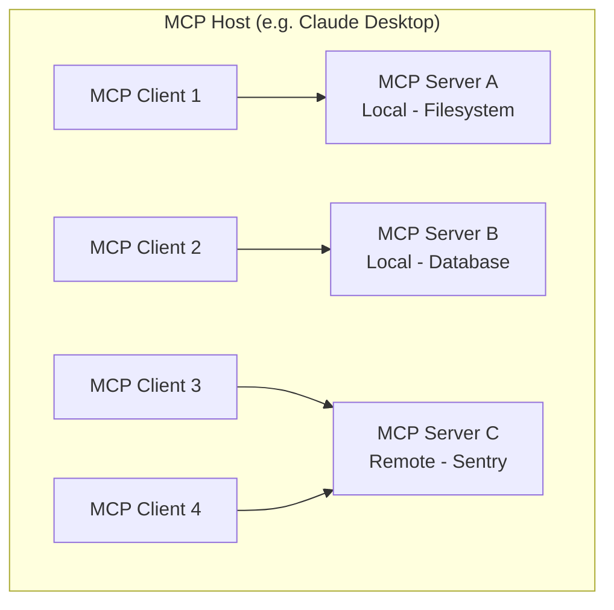
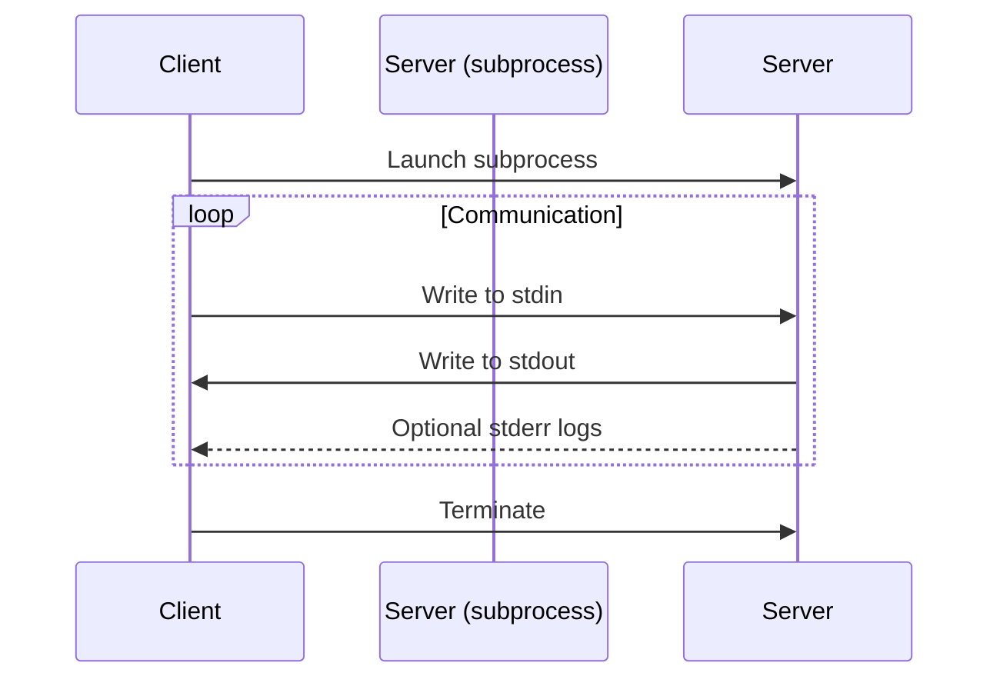
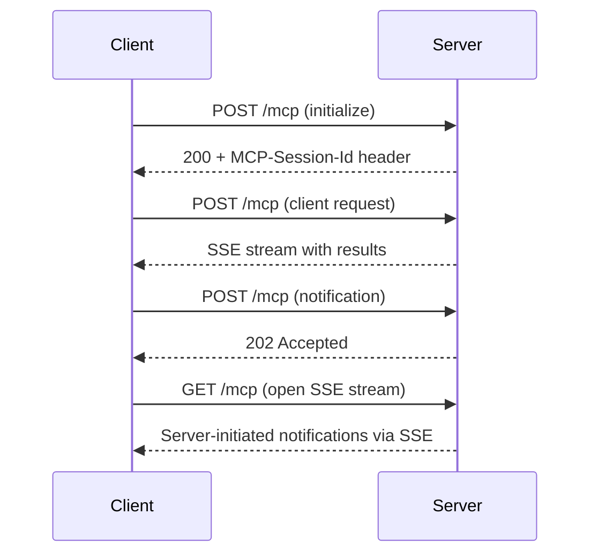
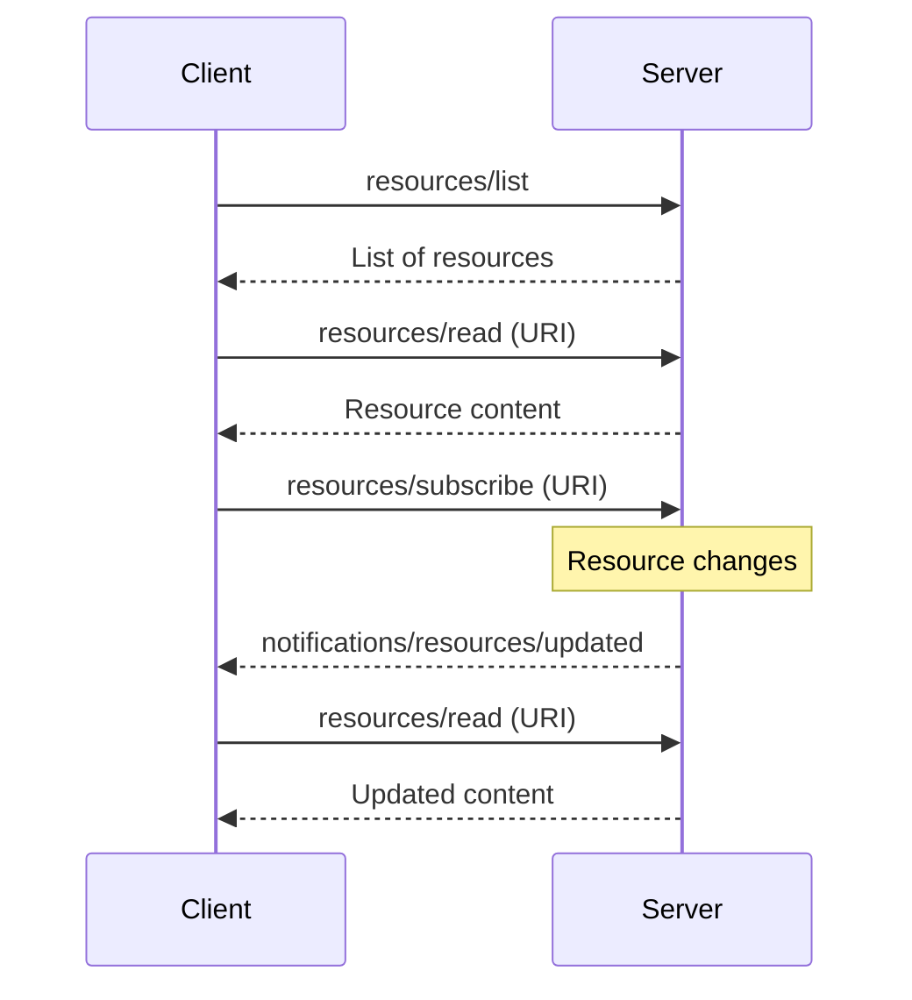
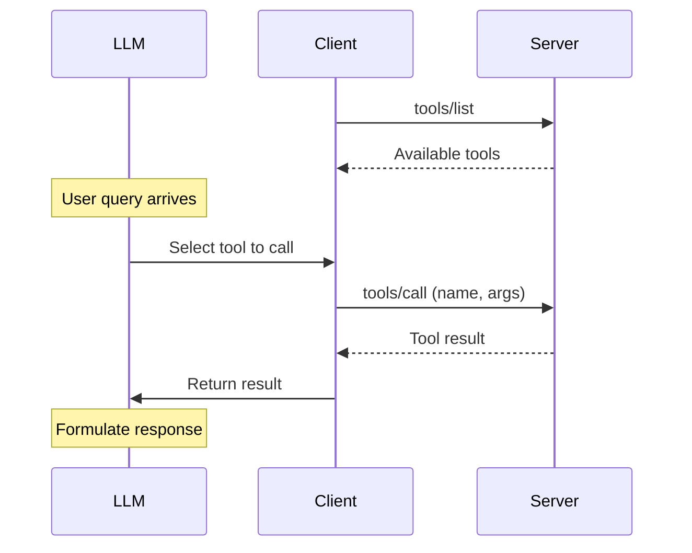
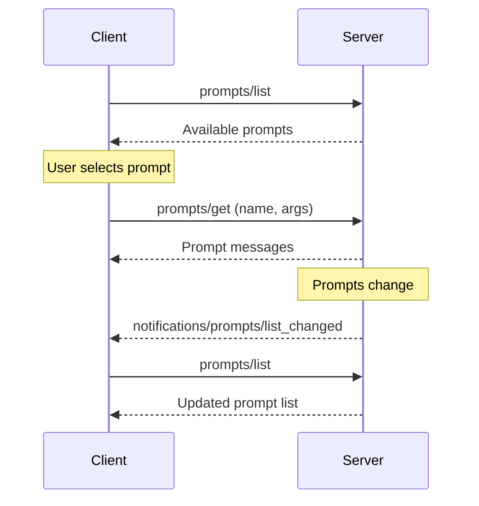

# MCP 官方文档 Mermaid 图表存档

来源: https://modelcontextprotocol.io/docs/learn/

## 1. Architecture: Host/Client/Server 拓扑

## 2. Transports: stdio 子进程生命周期

## 3. Transports: Streamable HTTP 完整流程

## 4. Resources: 发现/订阅/更新流程

## 5. Tools: LLM 驱动的发现/调用流程

## 6. Prompts: 列表/获取/更新流程

## 未能下载的截图 (CDN 防盗链)

- Resource picker UI: `mintcdn.com/.../resource-picker.png` (174x181)
- Slash command UI: `mintcdn.com/.../slash-command.png` (293x106)
